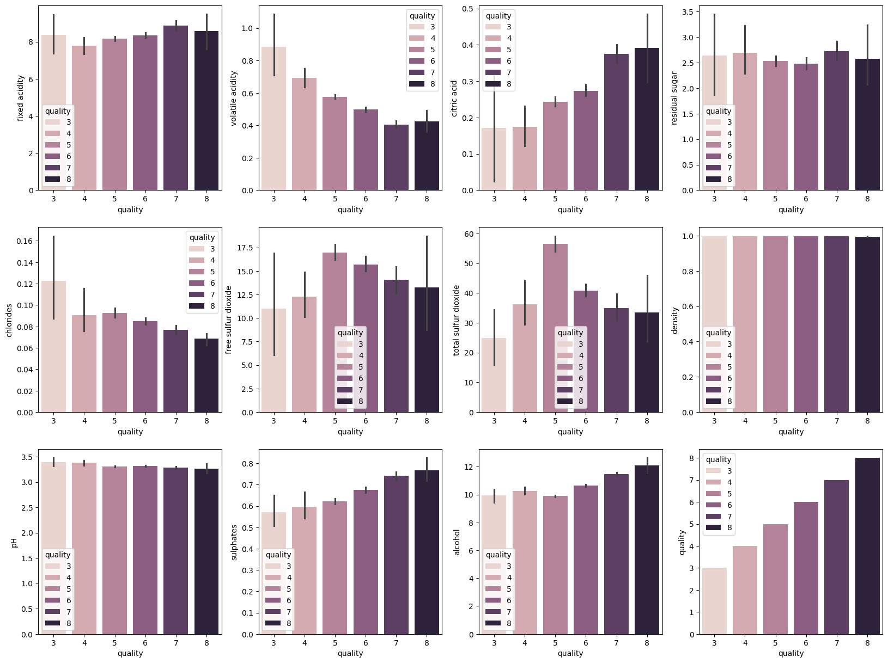
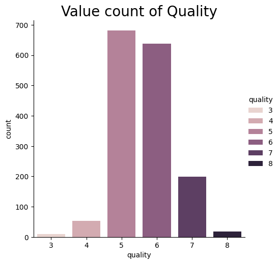
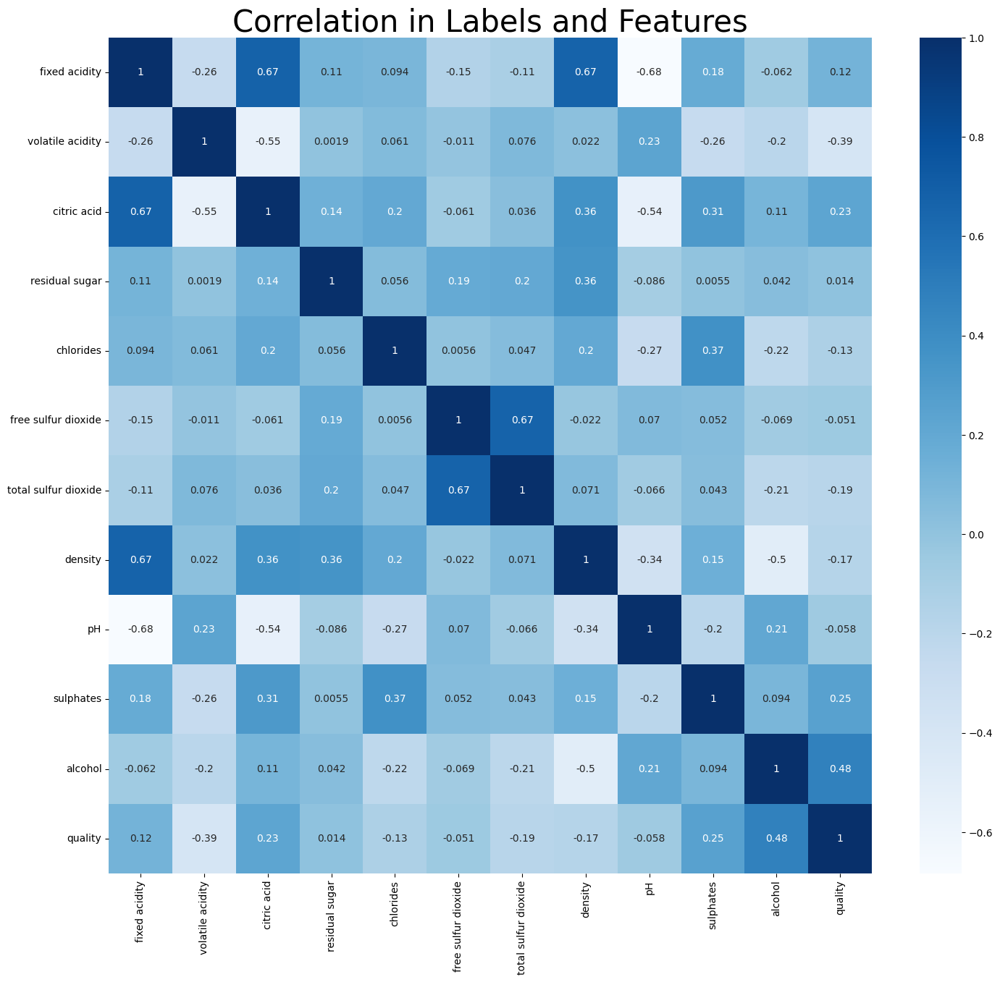

<h1 align="center">Wine Quality Prediction</h1>

  

<h2 align="center">Problem Statement</h2>

  <b><i>Using physicochemical properties to determine quality of wine</i></b>

## Dependencies

- numpy: Fundamental package for scientific computing with Python.
- pandas: Data manipulation and analysis library.
- scikit-learn: Machine learning library for building predictive models.
  - RandomForestClassifier: Ensemble learning method for classification.
  - train_test_split: Function for splitting data into train and test sets.
  - accuracy_score: Function for calculating the accuracy of model predictions.
- seaborn: Statistical data visualization library based on matplotlib.
- matplotlib: Comprehensive plotting library for creating static, interactive, and animated visualizations in Python.

## Data Vizualization

  
  
  

  Fig 1. &emsp;&emsp;&emsp;&emsp;&emsp;&emsp;&emsp;&emsp;&emsp;&emsp;&emsp;&emsp;&emsp;&emsp;&emsp;&emsp;Fig 2.&emsp;&emsp;&emsp;&emsp;&emsp;&emsp;&emsp;&emsp;&emsp;&emsp;&emsp;&emsp;&emsp;&emsp;&emsp;&emsp;&emsp;&emsp;&emsp;Fig 3.

## Outcomes

  <b>Fig1.</b>Show The relationship between every feature and price also plots every value of faeture with respect to price

  <b>Fig2.</b>Bar plot of quantity of every unique value in 'Quality'  

  <b>Fig2.</b>Show the heatmap or plots the correlation and its magnitude of label vs feature

# Final Result

<b><i>Accuracy<b></b></i> was found out to be to be <b><i>90%</i></b> using <b><i>RANDOME FORREST</i></b>

Model is saved in a binary file named <b><i>Saved_model</i></b>

